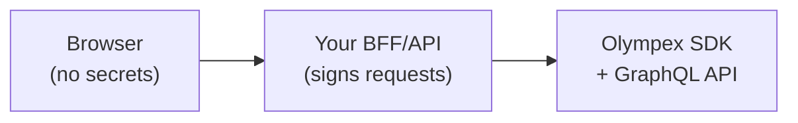

# Authentication

## Overview — server-side only

The Olympex SDK is a **server-side only** integration library. Run it in Node.js (22.15.0+)
environments you control: your backend, BFF, or serverless functions.

Three credentials are required for signed GraphQL traffic:

| Credential   | Source                        | Used as               |
| ------------ | ----------------------------- | --------------------- |
| `apiKey`     | `createAccount` response      | `x-api-key-id` header |
| `apiSecret`  | `createAccount` → `secretKey` | HMAC signing secret   |
| `passphrase` | `createAccount` → `password`  | `x-passphrase` header |

Never embed `apiSecret` or `passphrase` in browser bundles, mobile apps, or public repos.
The SDK does not provide a browser-safe mode.

> **Future (out of scope):** A v2 browser/proxy mode may exist later. Web applications
> must use a server-side proxy today (see [Server-side proxy pattern](#server-side-proxy-pattern)).

## Credential lifecycle

### 1. Bootstrap — `createAccount` (REST, once)

Onboarding is a **public REST call**. It does not use signed headers.

```
POST /api/v1/accounts
Content-Type: application/json

{ "name": "My App", "password": "<choose-a-strong-passphrase>" }
```

Success response (shape may be wrapped in `data`):

```json
{
  "apiKey": "550e8400-e29b-41d4-a716-446655440000",
  "secretKey": "base64url-encoded-secret-43-chars"
}
```

- `secretKey` is returned **once**. Store it immediately; it cannot be retrieved later.
- The `password` you send becomes your signing **passphrase** (hashed server-side).

SDK usage (no `initialize` required):

```ts
import { createAccount, initialize } from '@Olympex-io/olympex-sdk';

const { apiKey, secretKey } = await createAccount({
  name: 'My App',
  password: process.env.OLYMPEX_ACCOUNT_PASSWORD!,
});

// Persist in your secret store — never commit to git
// apiKey      → OLYMPEX_API_KEY
// secretKey   → OLYMPEX_API_SECRET
// password    → OLYMPEX_PASSPHRASE
```

### 2. Store secrets securely

Use environment variables or a secret manager (AWS Secrets Manager, Vault, etc.).
Map credentials as follows when calling `initialize`:

```ts
const client = initialize({
  apiKey: process.env.OLYMPEX_API_KEY!,
  apiSecret: process.env.OLYMPEX_API_SECRET!, // secretKey from createAccount
  passphrase: process.env.OLYMPEX_PASSPHRASE!, // password from createAccount
});
```

Set `OLYMPEX_BACKEND_URL` per deployment (see [Getting started — Backend URL](./getting-started.md#backend-url)).

### 3. Signed GraphQL — every protected call

All SDK methods that hit GraphQL (`quote`, `swap`, `txStatus`, `supportChain`, etc.)
automatically attach signed headers. You do not sign manually when using the SDK.

## Signed request algorithm

The SDK applies the following signing contract to every GraphQL request. Steps:

1. **Serialize body** — exact JSON string sent as the HTTP body (e.g. GraphQL payload).
2. **bodyHash** — `SHA256(body)` digest encoded as **base64url** (no padding).
3. **timestamp** — Unix seconds, string (e.g. `"1718812800"`).
4. **nonce** — 24 hex chars (`crypto.randomBytes(12).toString('hex')`).
5. **message** — `` `${timestamp}\n${nonce}\n${bodyHash}` `` (literal newline separators).
6. **x-value-info** — `Buffer.from(message).toString('base64')`.
7. **x-signature** — `HMAC-SHA256(message, apiSecret)` as lowercase hex.

### Pseudocode example

```text
body          = '{"query":"...","variables":{...}}'
bodyHash      = base64url( SHA256(body) )
timestamp     = "1718812800"
nonce         = "a1b2c3d4e5f6789012345678"
message       = timestamp + "\n" + nonce + "\n" + bodyHash
x-value-info  = base64( message )
x-signature   = hex( HMAC_SHA256(key=apiSecret, data=message) )
x-api-key-id  = apiKey
x-passphrase  = passphrase
```

The Olympex API validates `x-value-info`, checks the timestamp window (±300 s),
verifies the passphrase, and confirms `x-signature` with timing-safe comparison.

## Headers reference

| Header         | Required | Description                                     |
| -------------- | -------- | ----------------------------------------------- |
| `x-api-key-id` | Yes      | API key UUID from `createAccount`               |
| `x-value-info` | Yes      | Base64 of `timestamp\nnonce\nbodyHash`          |
| `x-passphrase` | Yes      | Passphrase chosen at account creation           |
| `x-signature`  | Yes      | HMAC-SHA256 hex of `timestamp\nnonce\nbodyHash` |
| `content-type` | Yes      | `application/json` for GraphQL POST bodies      |

## Error handling

| HTTP status | Stage              | Typical cause                                                                                 |
| ----------- | ------------------ | --------------------------------------------------------------------------------------------- |
| **401**     | Authentication     | Missing/invalid headers, bad signature, wrong passphrase, expired timestamp, inactive account |
| **403**     | Request validation | Body hash mismatch — request body was altered after signing                                   |

Authentication failures return **401 Unauthorized** before GraphQL executes.

Body hash validation runs after authentication. If the signed `bodyHash` does not match
`SHA256(actual body)`, the API returns **403 Forbidden** with:

```json
{
  "error": "Forbidden",
  "message": "Invalid body hash",
  "statusCode": 403
}
```

SDK callers typically see these as `OlympexNetworkError` with the HTTP status attached.

## Server-side proxy pattern

Web apps must **not** call Olympex with API secrets from the browser.



Your server-side proxy owns credential storage, request signing, and any user/session auth.
Olympex does not ship a proxy layer for browser clients.

## Security checklist

- [ ] Never commit `apiSecret`, `passphrase`, or `secretKey` to version control
- [ ] Load credentials from env vars or a secret manager at runtime
- [ ] Restrict server/BFF network access; use IP allowlists when the API supports them
- [ ] Rotate compromised credentials with Olympex ops (new account / key rotation policy)
- [ ] Log and alert on repeated 401/403 responses
- [ ] Run `createAccount` only from trusted server automation, not from client code
